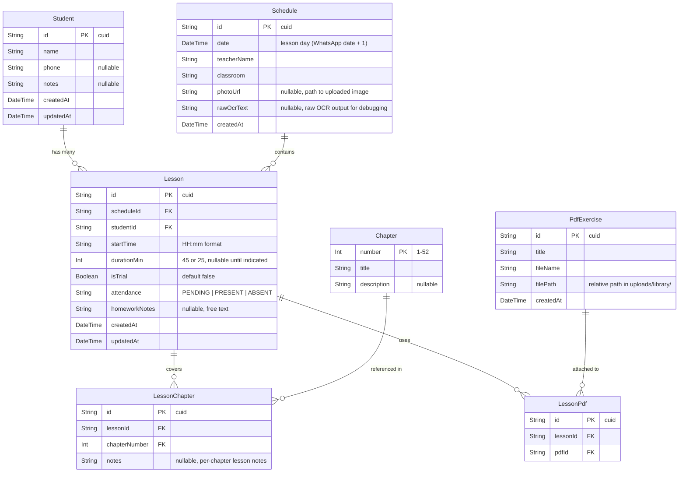
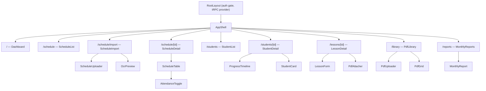
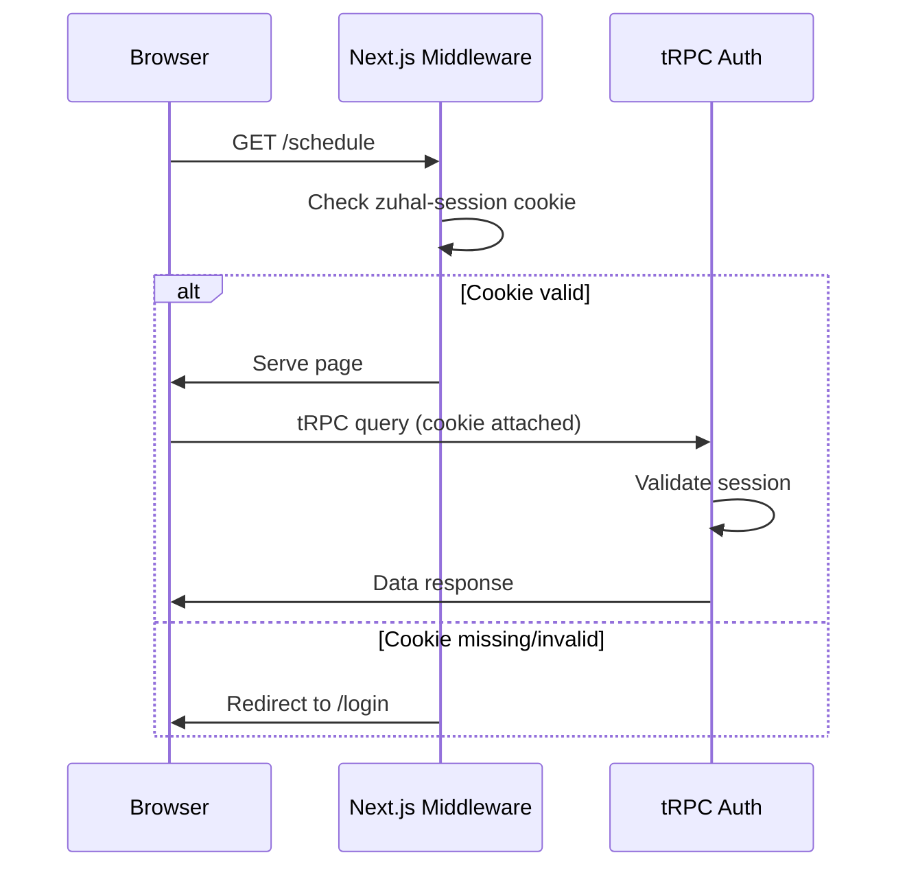
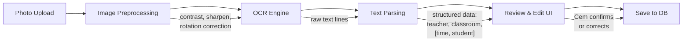
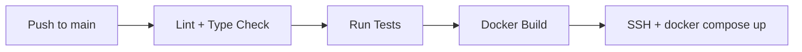

# Zuhal LMS — Architecture

A drum lesson management system built for Cem Yigman, drum teacher at Zuhal Music Academy. The app digitizes handwritten weekly schedules via OCR, tracks student progress through the D52 drum method, manages a PDF exercise library, and generates monthly teaching reports.

---

## 1. Tech Stack

| Layer | Technology | Rationale |
|-------|-----------|-----------|
| Framework | **Next.js 15 App Router** | Server components, streaming, file-based routing. Single deployable for both UI and API. |
| Language | **TypeScript (strict)** | End-to-end type safety from database to UI. |
| Styling | **Tailwind CSS v4 + shadcn/ui** | Utility-first CSS with a pre-built, accessible component library. No runtime cost. |
| ORM | **Prisma** | Type-safe database access, declarative schema, easy migrations. |
| Database | **PostgreSQL** | Relational data with strong integrity guarantees. Handles schedule, student, and progress data well. |
| API | **tRPC** | End-to-end typesafe RPC between Next.js client and server. No codegen, no REST boilerplate. |
| OCR | **Tesseract.js** (client-side) or **Google Cloud Vision API** | Extract text from schedule photos. Tesseract for zero-cost local processing; Cloud Vision as fallback for difficult handwriting. |
| PDF Storage | **Local filesystem** (Docker volume) | Simple, no external service needed. PDFs are small and few. |
| Package Manager | **pnpm** | Fast, disk-efficient, strict dependency resolution. |
| CI/CD | **GitHub Actions** | Automated lint, type-check, test, build, and deploy on push. |
| Deployment | **Docker Compose** | Single-command deployment to local server at `192.168.0.100`. |

---

## 2. Folder Structure

```
zuhal-lms/
├── .github/
│   └── workflows/
│       └── deploy.yml              # CI/CD pipeline
├── prisma/
│   ├── schema.prisma               # Database schema
│   ├── migrations/                  # Auto-generated migrations
│   └── seed.ts                     # Seed data (D52 chapters)
├── public/
│   └── uploads/
│       └── schedules/              # Uploaded schedule photos
├── src/
│   ├── app/
│   │   ├── layout.tsx              # Root layout (auth gate, providers)
│   │   ├── page.tsx                # Dashboard / home
│   │   ├── login/
│   │   │   └── page.tsx            # Login page
│   │   ├── schedule/
│   │   │   ├── page.tsx            # Schedule list view
│   │   │   ├── [id]/
│   │   │   │   └── page.tsx        # Single schedule detail + attendance
│   │   │   └── import/
│   │   │       └── page.tsx        # Photo upload + OCR import
│   │   ├── students/
│   │   │   ├── page.tsx            # Student list
│   │   │   └── [id]/
│   │   │       └── page.tsx        # Student detail + progress history
│   │   ├── lessons/
│   │   │   └── [id]/
│   │   │       └── page.tsx        # Lesson detail (chapter, homework, PDFs)
│   │   ├── library/
│   │   │   └── page.tsx            # PDF exercise library
│   │   ├── reports/
│   │   │   └── page.tsx            # Monthly reports
│   │   └── api/
│   │       └── trpc/
│   │           └── [trpc]/
│   │               └── route.ts    # tRPC HTTP handler
│   ├── server/
│   │   ├── trpc.ts                 # tRPC initialization + context
│   │   ├── router/
│   │   │   ├── index.ts            # Root router (merges all sub-routers)
│   │   │   ├── schedule.ts         # Schedule procedures
│   │   │   ├── student.ts          # Student procedures
│   │   │   ├── lesson.ts           # Lesson procedures
│   │   │   ├── chapter.ts          # D52 chapter procedures
│   │   │   ├── library.ts          # PDF library procedures
│   │   │   ├── report.ts           # Report procedures
│   │   │   └── auth.ts             # Auth procedures
│   │   └── services/
│   │       ├── ocr.ts              # OCR processing logic
│   │       └── pdf.ts              # PDF file management
│   ├── components/
│   │   ├── ui/                     # shadcn/ui primitives (button, input, etc.)
│   │   ├── schedule/
│   │   │   ├── ScheduleUploader.tsx    # Photo upload + preview
│   │   │   ├── OcrPreview.tsx          # OCR results review/edit
│   │   │   ├── ScheduleTable.tsx       # Day's lesson list
│   │   │   └── AttendanceToggle.tsx    # Present/absent toggle
│   │   ├── student/
│   │   │   ├── StudentCard.tsx         # Student summary card
│   │   │   └── ProgressTimeline.tsx    # Chapter progress over time
│   │   ├── lesson/
│   │   │   ├── LessonForm.tsx          # Chapter selection + homework notes
│   │   │   └── PdfAttacher.tsx         # Attach PDFs from library
│   │   ├── library/
│   │   │   ├── PdfUploader.tsx         # Upload new PDF to library
│   │   │   └── PdfGrid.tsx             # Browse library
│   │   ├── reports/
│   │   │   └── MonthlyReport.tsx       # Monthly summary display
│   │   └── shared/
│   │       ├── AppShell.tsx            # Sidebar + top bar layout
│   │       ├── PageHeader.tsx          # Page title + actions
│   │       └── EmptyState.tsx          # Empty state placeholder
│   ├── lib/
│   │   ├── trpc.ts                 # tRPC client + React Query hooks
│   │   ├── auth.ts                 # Auth utilities (session check)
│   │   └── utils.ts                # General helpers
│   └── types/
│       └── index.ts                # Shared TypeScript types
├── docker/
│   ├── Dockerfile                  # Multi-stage Next.js build
│   └── docker-compose.yml          # App + PostgreSQL
├── .env.example                    # Environment variable template
├── ARCHITECTURE.md
├── next.config.ts
├── tailwind.config.ts
├── tsconfig.json
├── package.json
└── pnpm-lock.yaml
```

---

## 3. Database Schema

### 3.1 Entity-Relationship Diagram



### 3.2 Table Details

#### `Student`
The student table is auto-populated from OCR. When a new name appears in a schedule, a student record is created. Cem can later merge duplicates or add contact info.

#### `Schedule`
One row per imported schedule photo. Typically two per week (Thursday + Sunday). The `date` field is computed as WhatsApp message date + 1 day.

#### `Lesson`
The central table. One row per student time-slot in a schedule. Links a student to a schedule at a specific time. Attendance starts as `PENDING` and is set by Cem after teaching.

#### `Chapter`
Seeded with D52 method's 52 chapters. Static reference data.

#### `LessonChapter`
Many-to-many join: a single lesson can cover multiple chapters, and a chapter is covered across many lessons.

#### `LessonPdf`
Many-to-many join: a lesson can reference multiple PDFs from the library, and a PDF can be used across many lessons.

### 3.3 Prisma Schema

```prisma
generator client {
  provider = "prisma-client-js"
}

datasource db {
  provider = "postgresql"
  url      = env("DATABASE_URL")
}

model Student {
  id        String   @id @default(cuid())
  name      String
  phone     String?
  notes     String?
  createdAt DateTime @default(now())
  updatedAt DateTime @updatedAt
  lessons   Lesson[]

  @@map("students")
}

model Schedule {
  id          String   @id @default(cuid())
  date        DateTime @db.Date
  teacherName String
  classroom   String
  photoUrl    String?
  rawOcrText  String?
  createdAt   DateTime @default(now())
  lessons     Lesson[]

  @@map("schedules")
}

model Lesson {
  id            String          @id @default(cuid())
  scheduleId    String
  studentId     String
  startTime     String          // "HH:mm"
  durationMin   Int?            // 45 or 25
  isTrial       Boolean         @default(false)
  attendance    Attendance      @default(PENDING)
  homeworkNotes String?
  createdAt     DateTime        @default(now())
  updatedAt     DateTime        @updatedAt

  schedule      Schedule        @relation(fields: [scheduleId], references: [id], onDelete: Cascade)
  student       Student         @relation(fields: [studentId], references: [id])
  chapters      LessonChapter[]
  pdfs          LessonPdf[]

  @@map("lessons")
}

enum Attendance {
  PENDING
  PRESENT
  ABSENT
}

model Chapter {
  number      Int             @id
  title       String
  description String?
  lessons     LessonChapter[]

  @@map("chapters")
}

model LessonChapter {
  id            String  @id @default(cuid())
  lessonId      String
  chapterNumber Int
  notes         String?

  lesson        Lesson  @relation(fields: [lessonId], references: [id], onDelete: Cascade)
  chapter       Chapter @relation(fields: [chapterNumber], references: [number])

  @@unique([lessonId, chapterNumber])
  @@map("lesson_chapters")
}

model PdfExercise {
  id        String      @id @default(cuid())
  title     String
  fileName  String
  filePath  String
  createdAt DateTime    @default(now())
  lessons   LessonPdf[]

  @@map("pdf_exercises")
}

model LessonPdf {
  id       String      @id @default(cuid())
  lessonId String
  pdfId    String

  lesson   Lesson      @relation(fields: [lessonId], references: [id], onDelete: Cascade)
  pdf      PdfExercise @relation(fields: [pdfId], references: [id])

  @@unique([lessonId, pdfId])
  @@map("lesson_pdfs")
}
```

---

## 4. API — tRPC Procedures

All procedures are grouped into sub-routers and merged into a single `appRouter`.

### `auth`
| Procedure | Type | Description |
|-----------|------|-------------|
| `auth.login` | mutation | Validate password, set session cookie |
| `auth.logout` | mutation | Clear session cookie |
| `auth.me` | query | Return current session status |

### `schedule`
| Procedure | Type | Description |
|-----------|------|-------------|
| `schedule.list` | query | List schedules, optional date range filter |
| `schedule.getById` | query | Single schedule with all lessons expanded |
| `schedule.import` | mutation | Accept photo, run OCR, create schedule + lessons |
| `schedule.delete` | mutation | Delete a schedule and cascade lessons |

### `student`
| Procedure | Type | Description |
|-----------|------|-------------|
| `student.list` | query | All students, searchable |
| `student.getById` | query | Student detail with lesson history |
| `student.update` | mutation | Edit name, phone, notes |
| `student.merge` | mutation | Merge duplicate student records |

### `lesson`
| Procedure | Type | Description |
|-----------|------|-------------|
| `lesson.getById` | query | Full lesson detail (chapters, PDFs, homework) |
| `lesson.setAttendance` | mutation | Mark present/absent |
| `lesson.setDuration` | mutation | Set 45 or 25 min |
| `lesson.toggleTrial` | mutation | Mark/unmark as trial lesson |
| `lesson.updateHomework` | mutation | Set homework notes text |
| `lesson.setChapters` | mutation | Set which D52 chapters were covered |
| `lesson.attachPdfs` | mutation | Attach PDFs from library |

### `chapter`
| Procedure | Type | Description |
|-----------|------|-------------|
| `chapter.list` | query | All 52 chapters |
| `chapter.getProgress` | query | Per-student chapter coverage over time |

### `library`
| Procedure | Type | Description |
|-----------|------|-------------|
| `library.list` | query | All PDFs, searchable |
| `library.upload` | mutation | Upload PDF file + create record |
| `library.delete` | mutation | Remove PDF from library |

### `report`
| Procedure | Type | Description |
|-----------|------|-------------|
| `report.monthly` | query | Total lessons & hours for a given month (includes trials) |
| `report.studentMonthly` | query | Per-student breakdown for a given month |

---

## 5. Component Tree



### Page Descriptions

| Route | Purpose |
|-------|---------|
| `/` | Dashboard: upcoming lessons, quick stats, recent imports |
| `/login` | Password entry (outside AppShell) |
| `/schedule` | Chronological list of imported schedules |
| `/schedule/import` | Upload photo → OCR preview → confirm & save |
| `/schedule/[id]` | View day's lessons, mark attendance |
| `/students` | Searchable student list |
| `/students/[id]` | Student history: all lessons, chapter progress, assigned exercises |
| `/lessons/[id]` | Edit lesson: chapters covered, homework notes, attach PDFs |
| `/library` | Upload, browse, search PDF exercises |
| `/reports` | Select month → view totals (lessons, hours, per-student breakdown) |

---

## 6. Auth Strategy

Cem is the only user. The auth system is minimal:

1. **Password-based login** — a single `ADMIN_PASSWORD` stored as a bcrypt hash in the environment variable `ADMIN_PASSWORD_HASH`.
2. **Session** — on successful login, a signed, HTTP-only cookie (`zuhal-session`) is set with a configurable expiry (default 30 days).
3. **Middleware** — Next.js middleware checks the cookie on every request except `/login` and static assets. Invalid or missing cookie → redirect to `/login`.
4. **tRPC context** — the session is validated in the tRPC context creator. All procedures (except `auth.login`) require a valid session.



No user registration, no roles, no OAuth. If multi-user support is ever needed, add a `User` table and upgrade session to carry a user ID.

---

## 7. OCR Pipeline

The schedule import flow is the most complex feature. Here's the processing pipeline:



### Parsing Rules
1. **Line 1**: Teacher name + classroom (e.g., "Cem Yigman - Studio 3")
2. **Remaining lines**: Time–student pairs (e.g., "14:00 Ali Demir")
3. **Date**: Extracted from WhatsApp metadata or manually entered. Stored as message date + 1 day.
4. **Duration indicator**: If present in the photo (e.g., "45dk" or "25dk"), parse and store per-lesson. Otherwise, leave `null`.
5. **Student matching**: Fuzzy match against existing students by name. Prompt Cem to confirm new students.

The review UI is critical — OCR on handwritten Turkish text will have errors. Cem must be able to correct every field before saving.

---

## 8. Deployment

### Docker Compose

```yaml
# docker/docker-compose.yml
services:
  app:
    build:
      context: ..
      dockerfile: docker/Dockerfile
    ports:
      - "3000:3000"
    environment:
      - DATABASE_URL=postgresql://zuhal:${DB_PASSWORD}@db:5432/zuhal_lms
      - ADMIN_PASSWORD_HASH=${ADMIN_PASSWORD_HASH}
      - NODE_ENV=production
    volumes:
      - uploads:/app/public/uploads
    depends_on:
      db:
        condition: service_healthy
    restart: unless-stopped

  db:
    image: postgres:16-alpine
    environment:
      - POSTGRES_USER=zuhal
      - POSTGRES_PASSWORD=${DB_PASSWORD}
      - POSTGRES_DB=zuhal_lms
    volumes:
      - pgdata:/var/lib/postgresql/data
    healthcheck:
      test: ["CMD-SHELL", "pg_isready -U zuhal -d zuhal_lms"]
      interval: 5s
      timeout: 3s
      retries: 5
    restart: unless-stopped

volumes:
  pgdata:
  uploads:
```

### Dockerfile (multi-stage)

```dockerfile
# docker/Dockerfile
FROM node:20-alpine AS base
RUN corepack enable && corepack prepare pnpm@latest --activate

FROM base AS deps
WORKDIR /app
COPY package.json pnpm-lock.yaml ./
RUN pnpm install --frozen-lockfile

FROM base AS builder
WORKDIR /app
COPY --from=deps /app/node_modules ./node_modules
COPY . .
RUN pnpm prisma generate
RUN pnpm build

FROM base AS runner
WORKDIR /app
ENV NODE_ENV=production
COPY --from=builder /app/.next/standalone ./
COPY --from=builder /app/.next/static ./.next/static
COPY --from=builder /app/public ./public
COPY --from=builder /app/prisma ./prisma

EXPOSE 3000
CMD ["node", "server.js"]
```

### CI/CD Pipeline (GitHub Actions)



The deploy step SSHs into `192.168.0.100`, pulls the latest image, runs `docker compose up -d`, and executes `pnpm prisma migrate deploy` inside the container.

---

## 9. Key Design Decisions

| Decision | Rationale |
|----------|-----------|
| **No external OCR service by default** | Avoid ongoing API costs. Tesseract.js runs locally. Cloud Vision is an opt-in fallback. |
| **Manual attendance** | OCR can't know who showed up. Cem marks attendance after each lesson. |
| **PDF stored on disk, not in DB** | Binary files belong on the filesystem. Metadata in PostgreSQL, files in a Docker volume. |
| **No real-time features** | Single user, no collaboration. Standard request-response is sufficient. |
| **Student auto-creation from OCR** | Reduces manual data entry. Fuzzy matching prevents most duplicates. |
| **Trial lessons counted in reports** | Per business requirement — Cem gets paid for trial lessons too. |
| **Homework as free text** | Cem doesn't need to track completion — just needs a reminder of what he assigned. |
| **No student-facing portal** | Students don't log in. This is Cem's internal tool. |
